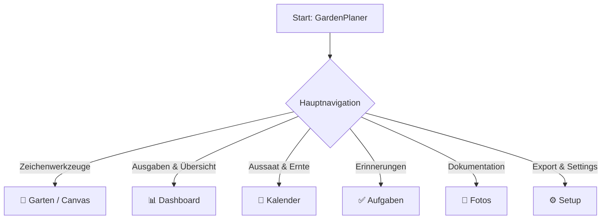
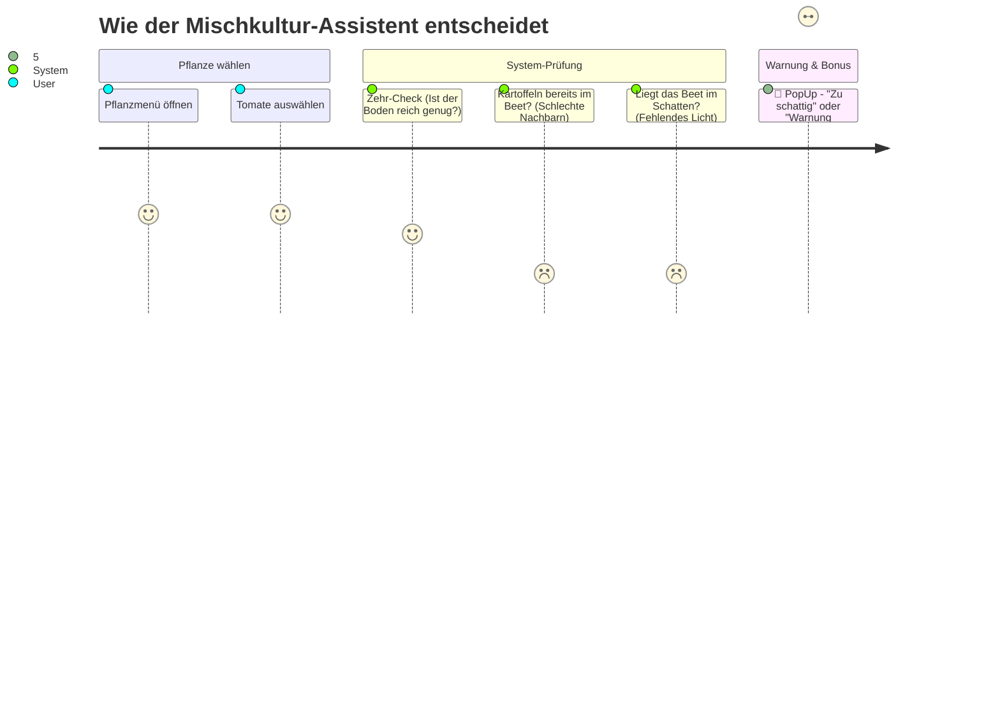

# 📖 GardenPlaner – Das offizielle Benutzerhandbuch

Willkommen beim GardenPlaner! Diese Anleitung führt dich Schritt für Schritt durch alle Funktionen, damit du direkt mit der perfekten Planung deines Gartens, Balkons oder Gemüsebeets starten kannst.

---

## 🗺️ 1. Orientierung: Die Benutzeroberfläche

Die App ist in verschiedene Hauptbereiche unterteilt, die du über die **linke Navigationsleiste** erreichst.

---

## 🌱 2. Beete anlegen & zeichnen (Garten / Canvas)

Der **"Garten"**-Reiter ist das Herzstück der App. Hier zeichnest du deinen Plan.

### Werkzeuge (Obere Leiste)
* 🖱️ **Auswählen:** Klicke auf bestehende Beete, um sie zu bearbeiten (öffnet das Panel rechts).
* 🔲 / ⭕ / 📐 **Form-Werkzeuge:** Zeichne Rechtecke, Kreise, L-Formen oder freie Polygone direkt auf die Fläche.
* 📏 **Lineal:** Klicke auf einen Start- und einen Endpunkt, um exakte Entfernungen in cm zu messen.
* 🧊 **3D-Ansicht:** Schwenkt den gesamten Plan in eine räumliche Ansicht. Perfekt, um Hochbeete oder Terrassen in ihrer Höhe zu begutachten.

### Ebenen & Typen (Linke Seitenleiste)
Du kannst deine Beete auf verschiedenen **Ebenen (Z-Achse)** anlegen (z. B. "Boden", "Terrasse", "Hochbeet").
Klicke auf das kleine **[ + ]** über der Liste, um ein schnelles Standardbeet in die Mitte fallen zu lassen.

---

## 🪴 3. Das Beet-Menü & Pflanzen (Rechte Leiste)

Sobald du auf der Zeichenfläche ein Beet anklickst, öffnet sich rechts der **Element-Editor**.

### Eigenschaften des Beetes
* **Maße & Drehung:** Verstelle Länge, Breite und Rotation millimetergenau.
* **Typ & Licht:** Wähle aus, ob das Beet eher *Sonnig*, *Halbschattig* oder *Schattig* liegt. Das ist wichtig für Pflanz-Warnungen!

### Pflanzen hinzufügen (Der Mischkultur-Assistent)
Klickst du im Beet auf **"+ Hinzufügen"** unter Pflanzungen, öffnet sich das Pflanz-Menü. Der GardenPlaner überwacht hier automatisch die Gesundheit deines Beetes:

Wenn alles passt, kannst du den Status der Pflanze verfolgen (*Geplant ➡️ Gepflanzt ➡️ Wachstum ➡️ Erntebereit*).

---

## ☀️ 4. Die Sonnen- & Schatten-Simulation

Unten links auf der Zeichenfläche findest du den schwarzen Kasten mit den **Sonnen-Slidern**.

1. **Uhrzeit (6:00 - 20:00):** Ziehe den Regler, um den Tag vergehen zu lassen. Der Schattenwurf deiner Beete wandert physikalisch korrekt mit.
2. **Monat (Jan - Dez):** Untersuche, wie lang die Schatten im tiefen Winter im Vergleich zum Sommer fallen.
3. **Nord-° (Kompass):** Drehe den Slider, bis der rote "N-Pfeil" der Himmelsrichtung in deinem echten Garten entspricht. Die Schatten passen sich automatisch an!

---

## 📊 5. Das Dashboard (Ausgaben & Vorbereitung)

Das Dashboard gibt dir den ultimativen Kontroll-Überblick.

* **Saisonale Vorschläge:** Zeigt dir, welche Pflanzen diesen Monat ausgesät oder geerntet werden sollten.
* **Vorbereitungen:** Sobald du Pflanzen in Beeten auf *"Geplant"* setzt, sammelt das Dashboard diese automatisch als Liste (z.B. "Saatgut/Setzlinge besorgen für Tomate").
* **💸 Budget:** Trage hier deine Rechnungen für Blumenerde, Schubkarre oder Samen ein. Die App sortiert sie nach Kategorien und rechnet zusammen, was der Garten dich dieses Jahr kostet.

---

## ✅ 6. Aufgaben & Dokumentation

* **Aufgaben-Reiter:** Ein einfaches To-Do-System. Trage Deadlines ein ("Hecke schneiden bis 14.04.") und hake sie bei Erledigung einfach ab.
* **Fotos-Reiter:** Dokumentiere den Verlauf. Lade Fotos des realen Gartens hoch und – wenn du möchtest – ordne sie einem bestimmten Beet im Editor zu.

---

## 💾 7. Export & Backup (Dein Garten offline)

Die App speichert alles vollautomatisch lokal in deinem Browser. Möchtest du deinen Plan jedoch sichern, teilen oder drucken, wechsele in den **⚙️ Setup** Reiter:

| Funktion | Erklärung |
| :--- | :--- |
| **Als Bild speichern (PNG)** | Schießt ein hochauflösendes, sauberes "Foto" von deinem Gartenplan (inkl. Grid und Schatten). Perfekt zum Zeigen oder Ausdrucken! |
| **Backup Export (JSON)** | Zieht die gesamte Garten-Datenbank in eine einzige Datei auf deine Festplatte. Ideal für Datensicherung oder zum Übertragen auf einen anderen PC. |
| **Backup Import (JSON)** | Lädt eine zuvor gespeicherte JSON-Datei wieder in die App. *(Achtung: Dies überschreibt den aktuellen Stand!)* |

---
*Wir wünschen viel Spaß und eine reiche Ernte mit dem GardenPlaner!* 🌱
